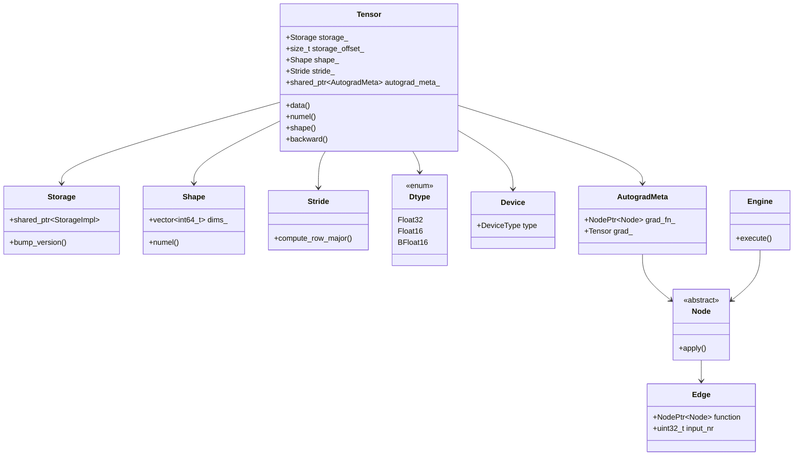
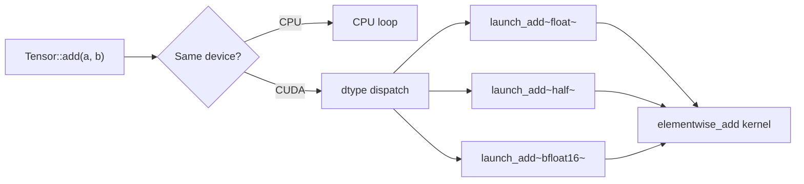
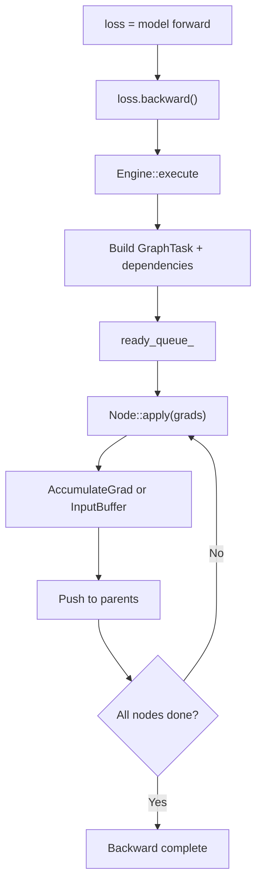
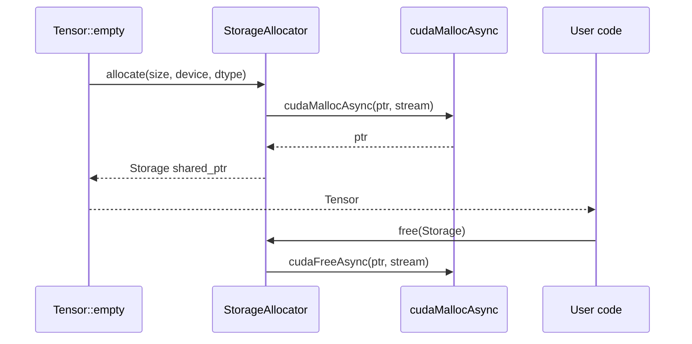

# TensorForge Architecture

This document describes the high-level structure of TensorForge, a C++20/CUDA 12 runtime for dense tensors and eager-mode autograd. The diagrams below show how the core abstractions fit together, how kernels are dispatched, how gradients flow, and how GPU memory is managed.

## Class Hierarchy

`Tensor` is the user-facing value type. It owns metadata about shape and stride, references a `Storage` block, and optionally carries `AutogradMeta` for gradient bookkeeping. `Node` and `Edge` model the dynamic computation graph, and `Engine` traverses it during backward passes.

## Kernel Dispatch Flow

Every operator first validates that its inputs live on the same device. CPU tensors fall back to scalar loops, while CUDA tensors route through a dtype dispatch layer that instantiates the same templated kernel for `float`, `half`, or `bfloat16`. This keeps the per-dtype code in one place and avoids duplicating kernel logic.

## Autograd Backward Execution

Calling `backward()` creates a `GraphTask` that records which `Node` objects depend on which outputs. The engine feeds ready nodes through a work queue, invokes each `Node::apply` with incoming gradients, accumulates or buffers the results, and schedules parent nodes until the entire graph has been processed.

## Allocator and Memory Lifecycle

`Tensor::empty` asks the allocator for a `Storage` object, which in turn requests stream-ordered memory from CUDA via `cudaMallocAsync`. The returned raw pointer is wrapped in a reference-counted `Storage` and handed back as a `Tensor`. When the last reference disappears, the allocator releases the block with `cudaFreeAsync` on the same stream.

## Related Documentation

- [DESIGN.md](DESIGN.md): design decisions and trade-offs
- [BENCHMARKS.md](BENCHMARKS.md): performance baselines and targets (to be added)
- [CONTRIBUTING.md](CONTRIBUTING.md): contribution guidelines (to be added)
