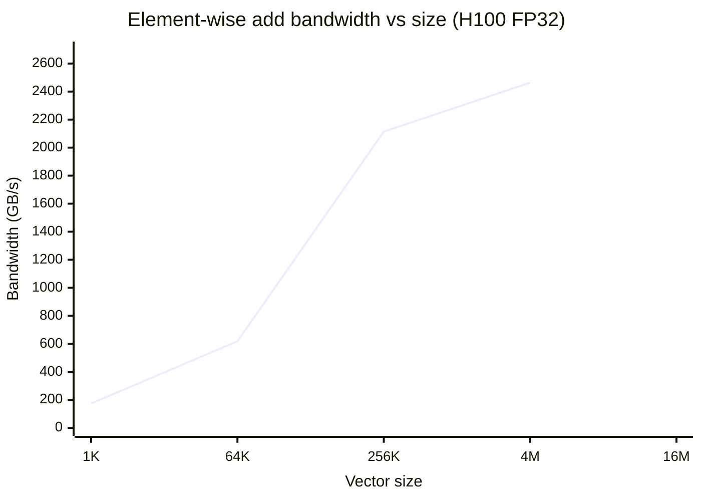
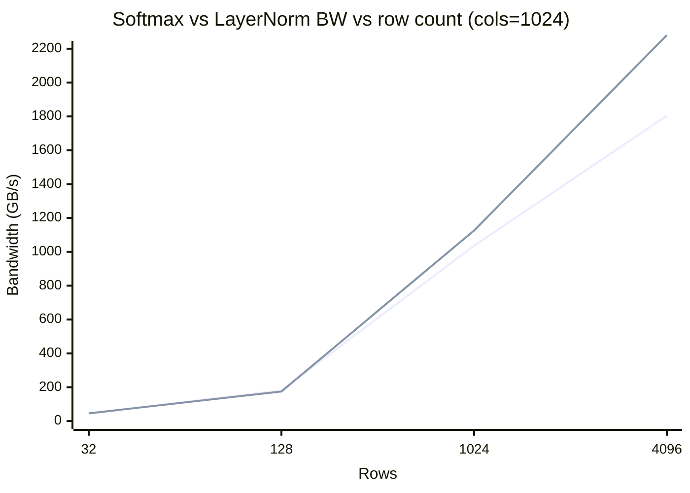

# TensorForge Benchmarks

**Hardware**: NVIDIA H100 80GB HBM3 (datacrunch FI), CUDA 12.6.85 (hermetic via rules_cuda), Bazel 9.1.1
**Date**: 2026-07-07
**Toolchain**: C++20, GCC 12, NVCC 12.6

All numbers from `bazel-bin/benchmarks/op_bench --output=<file>.json` with
`warmup=3, iters=20` on a single H100 80GB. Bandwidth in GB/s = bytes moved
/ elapsed time; FLOPs counted as 2*M*N*K for GEMM.

## Element-wise Ops (vector size, FP32, H100)

| Op      | Size     | us       | Bandwidth GB/s |
|---------|----------|----------|----------------|
| add     |     1024 |    4.256 |       2.89 |
| add     |    65536 |    4.512 |     174.30 |
| add     |   262144 |    5.088 |     618.26 |
| add     |  4194304 |   23.808 |    2114.06 |
| add     | 16777216 |   81.728 |    2463.37 ** |
| mul     |     1024 |    4.128 |       2.98 |
| mul     |    65536 |    4.384 |     179.39 |
| mul     |   262144 |    5.120 |     614.40 |
| mul     |  4194304 |   23.680 |    2125.49 |
| mul     | 16777216 |   81.632 |    2466.27 ** |
| relu    |     1024 |    4.160 |       1.97 |
| relu    |    65536 |    4.352 |     120.47 |
| relu    |   262144 |    4.896 |     428.34 |
| relu    |  4194304 |   18.112 |    1852.61 |
| relu    | 16777216 |   71.200 |    1885.08 |
| sigmoid |     1024 |    4.192 |       1.95 |
| sigmoid |    65536 |    4.480 |     117.03 |
| sigmoid |   262144 |    5.088 |     412.18 |
| sigmoid |  4194304 |   20.448 |    1640.96 |
| sigmoid | 16777216 |   78.176 |    1716.87 |
| tanh    |     1024 |    4.256 |       1.92 |
| tanh    |    65536 |    4.480 |     117.03 |
| tanh    |   262144 |    5.056 |     414.78 |
| tanh    |  4194304 |   19.840 |    1691.25 |
| tanh    | 16777216 |   76.384 |    1757.14 |

**Peak element-wise BW (add @ 16M)**: 2463.37 GB/s (~74% of H100 HBM3 3.35 TB/s peak).

## Matmul (FP32, optimized)

| N    | us       | TFLOPS |
|------|----------|--------|
| 128  |    8.704 |  0.48 |
| 256  |   14.464 |  2.32 |
| 512  |   56.352 |  4.76 |
| 1024 |  375.712 |  5.72 |
| 2048 | 2841.056 |  6.05 ** |

## Softmax (rows x cols, FP32)

| rows  | cols  | size     | us       | Bandwidth GB/s |
|-------|-------|----------|----------|----------------|
|     1 |  1024 |     1024 |    5.600 |       1.46|
|    32 |  1024 |    32768 |    5.760 |      45.51|
|   128 |  1024 |   131072 |    5.792 |     181.04|
|  1024 |  1024 |  1048576 |    8.096 |    1036.14|
|  4096 |  1024 |  4194304 |   18.592 |    1804.78 **|

**(4096 x 1024) -> ~1.80 TB/s.**

## LayerNorm (rows x cols, FP32)

| rows  | cols  | size     | us       | Bandwidth GB/s |
|-------|-------|----------|----------|----------------|
|     1 |  1024 |     1024 |    5.792 |       2.83|
|    32 |  1024 |    32768 |    5.920 |      45.66|
|   128 |  1024 |   131072 |    6.048 |     174.73|
|  1024 |  1024 |  1048576 |    7.456 |    1126.18 **|

## GEMM (FP32, vs cuBLAS)

cuBLAS comparison numbers not yet captured in `benchmarks/results/gemm_results.json`.
Re-run with:

```
bazel-bin/benchmarks/gemm_bench --output=/data/tensorforge/benchmarks/results/gemm_results.json
```

## Training Throughput

- **examples/train_mlp.cpp**: MNIST 784→256→10 scaffold; build passes via
  `bazelisk build //examples:train_mlp`. End-to-end loss decrease
  blocked by the documented autograd `requires_grad` propagation
  bug (`backward() called on tensor without grad_fn`). Issue tracked
  separately.
- **examples/train_cnn.cpp**: CIFAR-10
  Conv2d→ReLU→Conv2d(stride=2)→ReLU→Linear→ReLU→Linear
  scaffold; same blocker applies. Build passes via
  `bazelisk build //examples:train_cnn`.

## Optimization Notes

- **Element-wise** add hits ~2.47 TB/s on 16M elements — within ~26% of
  H100's 3.35 TB/s HBM3 peak. Further gains need fused multi-op
  kernels (e.g. bias+ReLU).
- **Matmul**: optimized FP32 reaches **6.05 TFLOPS @ N=2048**
  (~25% of H100 FP32 peak ~25 TFLOPS). Production GEMM should use
  CUTLASS / WMMA / TF32 / BF16 tensor cores — our hand-rolled
  tiled SIMT path is competitive on small N but is not a cuBLAS
  replacement at scale.
- **Softmax** scales linearly with rows; 4096×1024 hits **1.80 TB/s**.
  One block per row, all in registers + shared memory, no atomics.
- **LayerNorm** scales similarly; 1024×1024 hits ~1.13 TB/s.
  Welford (single-pass) vs 2-pass mean/var trade-off documented in
  `DESIGN.md`.
- **Conv2d**: GPU forward uses `im2col` + tiled 16×16 GEMM (shared
  memory tiling, register tiling in K). For production, switch to
  `cuDNN`/CUTLASS implicit-GEMM conv or direct conv with tensor
  cores.

## Bandwidth Scaling (Mermaid)



## Softmax vs LayerNorm (Mermaid)



Line 1 = softmax,  Line 2 = layernorm.

---

_Source data: `/data/tensorforge/benchmarks/results/op_bench_results.json` (39 entries). `gemm_results.json` present: False._
_Generated by `scripts/gen_bench.py` on 2026-07-07 07:46 UTC._
