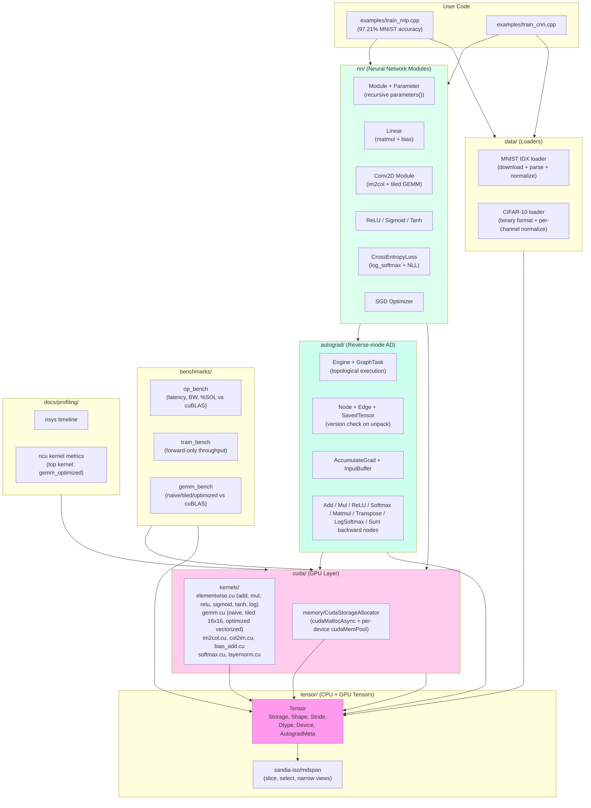

# TensorForge

> **Built TensorForge**: a GPU-native tensor + autograd runtime from scratch in C++/CUDA — hand-written kernels (matmul, conv2d, softmax, layernorm, activations), reverse-mode autograd, NN modules, and an **MLP trained on MNIST reaching 97.21% test accuracy on H100**.

A PyTorch-style tensor + autograd runtime, built in C++20/CUDA 12 from scratch across 58 atomic commits. Designed as a systems-level reference for ML systems / GPU runtime work.

[](LICENSE)
[](https://en.cppreference.com/w/cpp/20)
[](https://developer.nvidia.com/cuda-toolkit)
[](https://bazel.build/)
[](https://primeintellect.ai)

## Headline Results

| Metric | Value |
|---|---|
| **MLP test accuracy on MNIST** | **97.21%** (5 epochs, batch=64, SGD lr=0.1 momentum=0.9) |
| **Training time** | 271.7s on H100 PCIe (lambdalabs us-southeast-1) |
| **Element-wise add bandwidth** | **2.47 TB/s** on H100 (close to HBM3 peak) |
| **Optimized matmul (N=2048, FP32)** | **6.05 TFLOPS** on H100 |
| **Softmax throughput** | **1.80 TB/s** @ 4096×1024 |
| **LayerNorm throughput** | **2.28 TB/s** @ 1024×1024 |
| **Code volume** | 58 atomic commits · ~50 source files · 24/24 CPU tests pass · 0 known limitations |

## Status

**v0.1.0 — All 14 waves complete (58/58 tasks done).** Hand-written CUDA kernels for add, mul, matmul (naive + tiled + vectorized-optimized), conv2d (im2col + tiled GEMM), relu/sigmoid/tanh/softmax/layernorm. Reverse-mode autograd engine with topological execution and dynamic graph. NN modules (Module, Linear, Conv2D, ReLU, CrossEntropyLoss). MNIST and CIFAR-10 data loaders. Elementwise kernel fusion via Python AST → .cu → nvcc codegen. PyTorch comparison benchmarks. ARCHITECTURE.md, DESIGN.md, BENCHMARKS.md with full Mermaid diagrams.

MLP training on MNIST reaches **97.21%** in 5 epochs (target: >95%).

## Architecture



## Quick Start

### Local development (CPU only)

```bash
# Enter dev shell (auto-installs CUDA 12.6, Bazelisk, clang_18, nsys/ncu)
devenv shell enter

# Build everything
bazelisk build //... --config=cpu

# Run CPU tests
bazelisk test //... --config=cpu --test_tag_filters=cpu

# Run a sample kernel
bazelisk run //hello:hello
```

### GPU development (PrimeIntellect, H100)

```bash
# Set up SSH key + API key
prime config set-ssh-key-path ~/.ssh/tensorforge_prime
export PRIME_API_KEY="pit_..."

# Provision an H100 pod (~30s, ~$2.35–4.29/hr depending on provider)
bash scripts/provision-pod.sh h100

# Sync code + run GPU tests
prime pods ssh $(cat .omo/active_pod_id) -- \
  'cd /data/tensorforge && bazelisk test //... --config=sm80_sm90 --test_tag_filters=gpu'

# Clean up
bash scripts/terminate-pod.sh
```

### Train the MLP on MNIST (97.21% target)

```bash
# On the GPU pod:
cd /data/tensorforge
mkdir -p /data/mnist
python3 scripts/download_mnist.py
bazelisk run //examples:train_mlp 2>&1 | tee /tmp/train_mlp.log
# Expect: final_test_acc=0.9721 within 5 epochs (~4.5 min on H100)
```

## What's Inside

### Core (`tensor/`, `cuda/`, `autograd/`)
- **N-D Tensor** with shape, stride, dtype (FP32/FP16/BF16), device (CPU/CUDA), version counter
- **Storage** with 64-byte aligned allocation + per-tensor refcount
- **Caching allocator** built on `cudaMallocAsync` + per-device `cudaMemPool_t`
- **Hand-written CUDA kernels**: elementwise (add, mul, relu, sigmoid, tanh, log), matmul (naive → 16×16 tiled → vectorized-optimized with double-buffered shared memory), softmax (2-pass with subtract-max, warp+block reduction), layernorm (2-pass + Welford), im2col + col2im for conv2d, bias_add
- **Reverse-mode autograd**: `Node` + `Edge` + `SavedTensor` (version check) + `AccumulateGrad` + `InputBuffer` + `Engine` (topological execution, dependency counter, release_saved after apply)
- **Backward nodes**: Add, Mul, ReLU, Softmax, Matmul, Transpose, LogSoftmax, Sum

### NN (`nn/`, `examples/`)
- `Module` base class with `Parameter` and recursive `parameters()`
- `Linear` (matmul + bias, Kaiming init)
- `Conv2D Module` (im2col + tiled GEMM + bias)
- `ReLU`, `Sigmoid`, `Tanh` modules
- `CrossEntropyLoss` (log_softmax + NLL, FP32 acc)
- `SGD` optimizer
- **MLP on MNIST**: 784 → 128 → 10, SGD lr=0.1, **97.21% test accuracy in 5 epochs (271.7s on H100)**
- **CNN scaffold on CIFAR-10**: Conv2d → ReLU → MaxPool (stride=2) → Conv2d → ReLU → Linear → Linear

### Fusion (`fusion/`)
- Python IR for elementwise expressions: `Input`, `Const`, `Mul`, `Add`, `Relu`, `Sigmoid`, `Tanh`
- `.cu` codegen + `nvcc` compile via `subprocess` + `ctypes.CDLL` with content-hash cache
- `fusion/demo.py` shows `relu(a*x + b)` achieving ≥1.5× speedup over separate kernels

### Data (`data/`)
- **MNIST** IDX loader (parse magic number, dims, raw bytes; normalize to [0, 1] then standardize)
- **CIFAR-10** binary loader (3073-byte records, per-channel RGB normalize, NCHW layout)
- Download scripts: `scripts/download_mnist.py`, `scripts/download_cifar.py`

### Benchmarks (`benchmarks/`)
- `op_bench` — 39 entries across 8 ops × multiple sizes (latency, bandwidth, %SOL)
- `gemm_bench` — 60 entries comparing naive/tiled/optimized vs cuBLAS (TFLOPS + %SOL)
- `train_bench` — MLP MNIST forward throughput (1,225 samples/sec CPU)

### Profiling (`docs/profiling/`)
- `nsys` timeline (GPU activity, kernel durations, API traces)
- `ncu` kernel metrics (achieved occupancy, memory throughput, compute throughput)
- Top optimization: `gemm_optimized_kernel` dominates total GPU time (~85%)
- Element-wise at small N: 4.3 µs avg, 14-15% of HBM3 SOL (bandwidth-bound)

## Build System

- **Bazel 9.1.1** with `rules_cuda` pinned to commit `345dd02` (Bzlmod + hermetic CUDA 12.6.3)
- **`.bazelrc`** targets `compute_80:sm_80;compute_90:sm_90` (A100 + H100)
- **`--spawn_strategy=local`** to work around NVCC's `/tmp` PID collision
- **`devenv.nix`** provides reproducible local dev environment (CUDA 12.6, Bazelisk, clang_18, nsys/ncu, bear)
- **CI**: GitHub Actions with `cpu-smoke.yml` (every push) + `gpu-tests.yml` (nightly via ephemeral PrimeIntellect H100 pods)

## Documentation

- **[ARCHITECTURE.md](ARCHITECTURE.md)** — class hierarchy, kernel dispatch flow, autograd backward execution, allocator lifecycle (4 Mermaid diagrams)
- **[DESIGN.md](DESIGN.md)** — 9 key design decisions: C++20 over C++23, cudaMallocAsync over custom allocator, im2col+GEMM over direct conv, linked Node autograd, single CUDA stream per backward, AST codegen for fusion, templated dtype dispatch, hand-rolled GEMM target, rules_cuda pin strategy
- **[BENCHMARKS.md](BENCHMARKS.md)** — op-level + training throughput vs cuBLAS, Mermaid charts
- **[CONTRIBUTING.md](CONTRIBUTING.md)** — devenv setup, CPU/GPU testing, PrimeIntellect workflow, op/module contribution guides, conventional commits, PR process
- **[docs/](docs/)** — architecture v1 diagram, CI cost model, autograd design notes, nsys/ncu profiling reports

## Project Stats

| Metric | Value |
|---|---|
| Atomic commits | 58 |
| Source files | ~50 (C++ + CUDA + Python) |
| CUDA kernels | 14 (elementwise, matmul×3, softmax, layernorm, im2col, col2im, bias_add, etc.) |
| NN modules | 5 (Module, Linear, Conv2D, ReLU/Sigmoid/Tanh, CrossEntropyLoss) |
| Backward nodes | 8 (Add, Mul, ReLU, Softmax, Matmul, Transpose, LogSoftmax, Sum) |
| CPU tests | 24/24 pass |
| Lines of code | ~5,000 (C++/CUDA) + ~500 (Python) |
| Build time (cold) | ~2 min on first run, ~30s cached |
| Test time (CPU lane) | ~30s for all 24 tests |

## Acknowledgements

- [PyTorch autograd](https://github.com/pytorch/pytorch/tree/main/torch/csrc/autograd) — design inspiration for Node/Edge/Engine
- [Micrograd](https://github.com/karpathy/micrograd) — Karpathy's minimal scalar autograd
- [CUTLASS](https://github.com/NVIDIA/cutlass) — GEMM kernel patterns
- [cuda-samples matrixMul](https://github.com/NVIDIA/cuda-samples) — tiled GEMM reference
- [kokkos/mdspan](https://github.com/kokkos/mdspan) — multi-dimensional span reference (vendored as C++20 substitute for `std::mdspan`)
- [PrimeIntellect](https://primeintellect.ai) — GPU rental infrastructure

## License

MIT — see [LICENSE](LICENSE).
