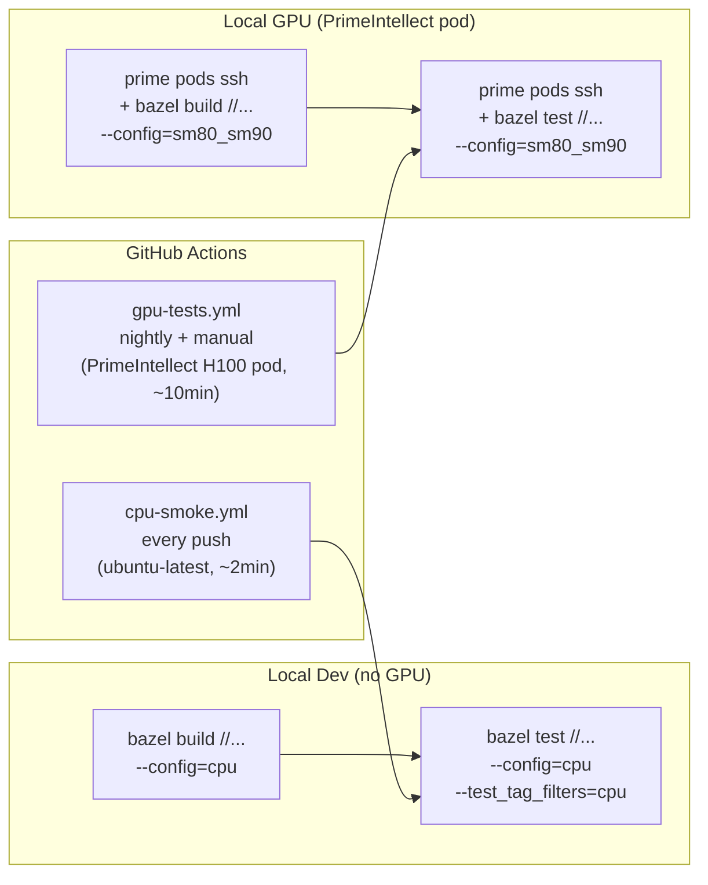

# TensorForge Architecture

TensorForge is a C++20/CUDA 12 GPU tensor and autograd runtime. The architecture separates the tensor storage and view layer from CUDA kernels, reverse-mode automatic differentiation, neural network modules, data loaders, and benchmarking tools.

## Component Diagram

The component diagram shows how user training examples depend on NN modules, data loaders, and the autograd engine, while the autograd engine and NN modules dispatch GPU work through the CUDA layer and store results in the tensor layer.

```mermaid
flowchart TB
    subgraph User["User Code"]
        ML["train_mlp.cpp<br/>train_cnn.cpp"]
    end

    subgraph NN["nn/ (Neural Network Modules)"]
        Module["Module<br/>Parameter"]
        Linear["Linear"]
        Conv2D["Conv2D"]
        ReLU["ReLU"]
        CEL["CrossEntropyLoss"]
    end

    subgraph Autograd["autograd/ (Reverse-mode AD)"]
        Engine["Engine<br/>GraphTask"]
        Node["Node + Edge<br/>SavedTensor"]
        AccumGrad["AccumulateGrad<br/>InputBuffer"]
    end

    subgraph CUDA["cuda/ (GPU Layer)"]
        Kernels["kernels/<br/>add, mul, matmul,<br/>conv2d, relu,<br/>softmax, layernorm"]
        Alloc["memory/<br/>cudaMallocAsync"]
    end

    subgraph Tensor["tensor/ (CPU + GPU Tensors)"]
        Tensor["Tensor<br/>Storage, Shape,<br/>Dtype, Device"]
        Mdspan["sandia-iso/mdspan<br/>(views)"]
    end

    subgraph Data["data/ (Loaders)"]
        MNIST["MNIST IDX"]
        CIFAR["CIFAR-10"]
    end

    subgraph Bench["benchmarks/"]
        OpBench["op_bench<br/>(vs PyTorch cuBLAS)"]
        TrainBench["train_bench<br/>(vs PyTorch)"]
    end

    ML --> NN
    ML --> Data
    NN --> Autograd
    NN --> CUDA
    Autograd --> CUDA
    Autograd --> Tensor
    CUDA --> Tensor
    Kernels --> Tensor
    Alloc --> Tensor
    Tensor --> Mdspan
    Data --> Tensor
    Bench --> CUDA
    Bench --> Tensor

    style Tensor fill:#f9e
    style CUDA fill:#fce
    style Autograd fill:#cfe
    style NN fill:#dfe
```

## Build/Test Pipeline

The build and test pipeline supports local CPU-only development, local GPU development on a PrimeIntellect pod, and CPU smoke plus GPU nightly testing in GitHub Actions.



## Future Documentation

A deeper architectural overview, including design trade-offs, memory layout details, autograd graph semantics, and performance considerations, will be added in `ARCHITECTURE.md` as part of task T51.
